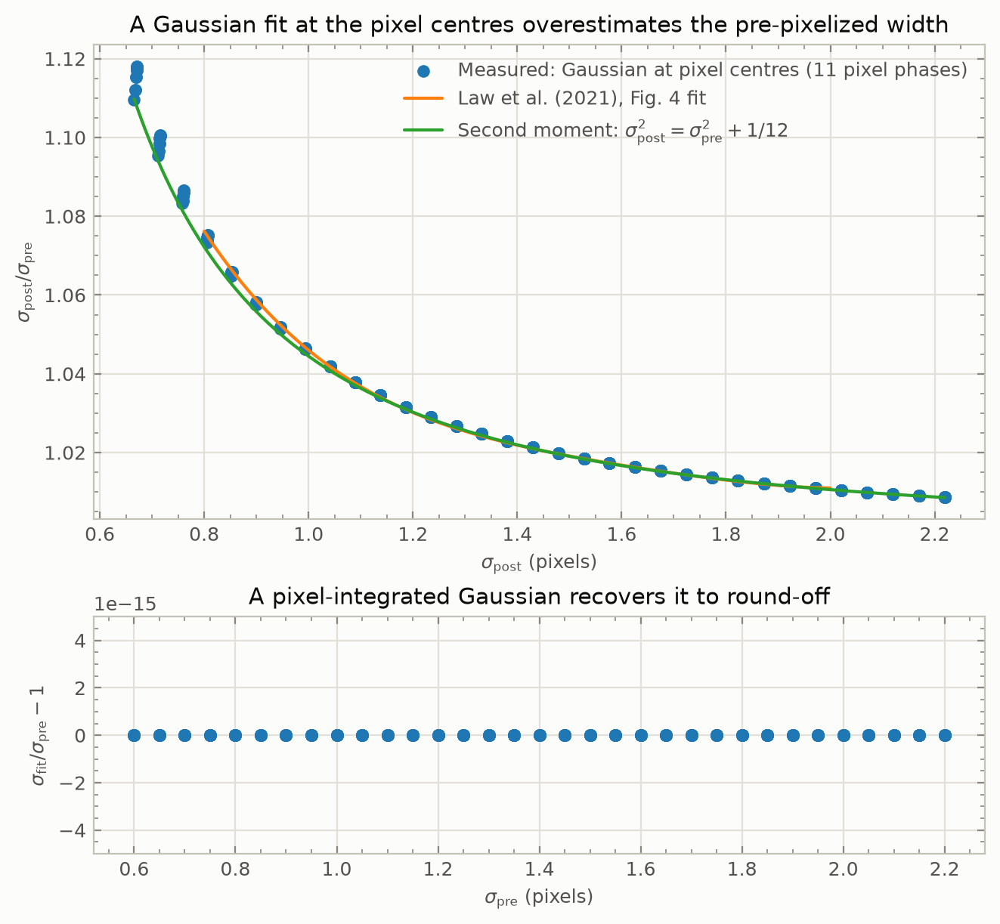
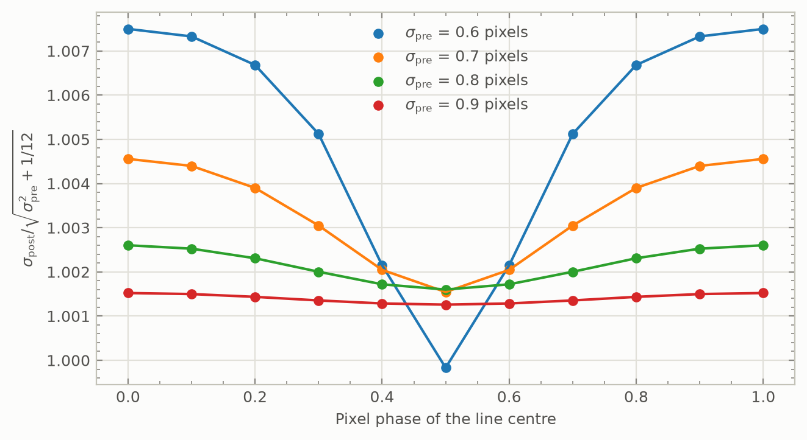
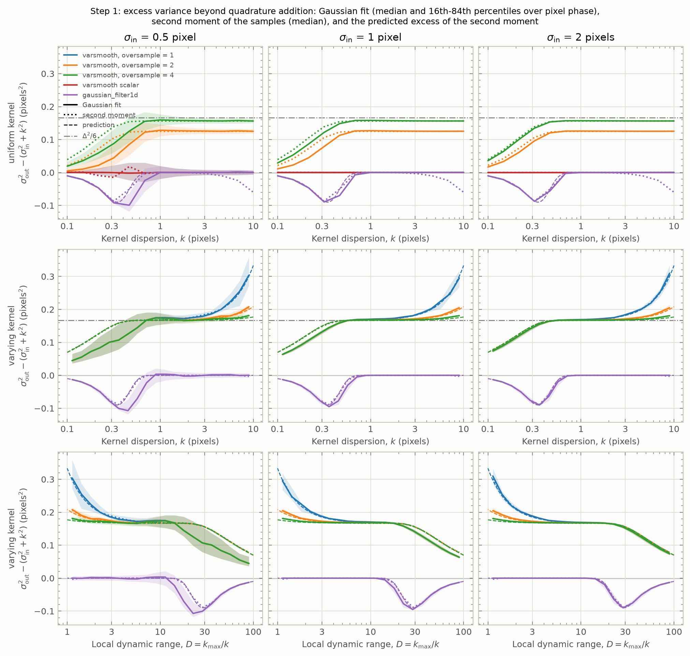
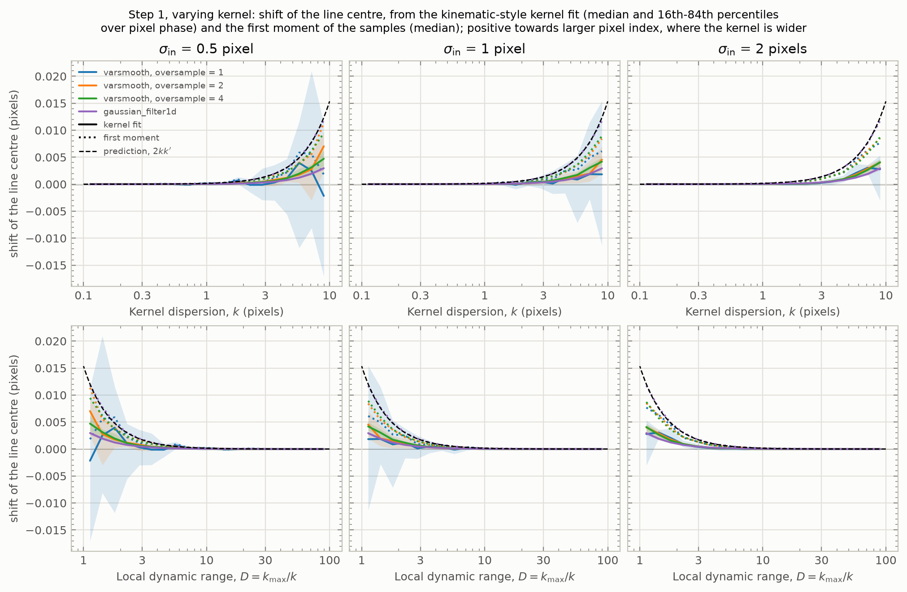
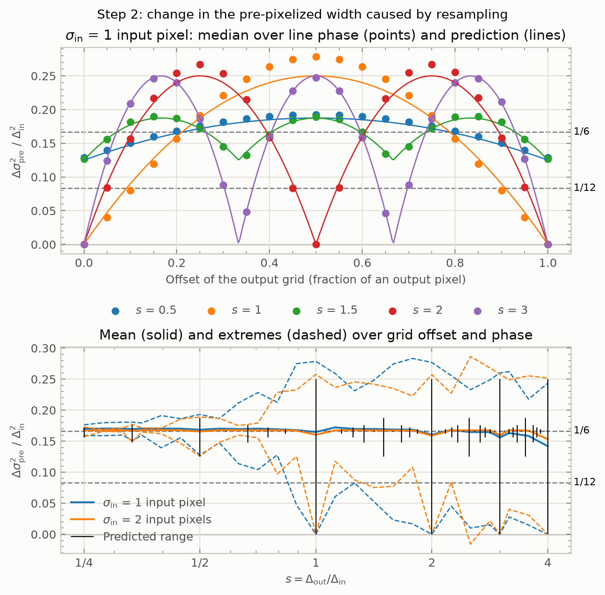
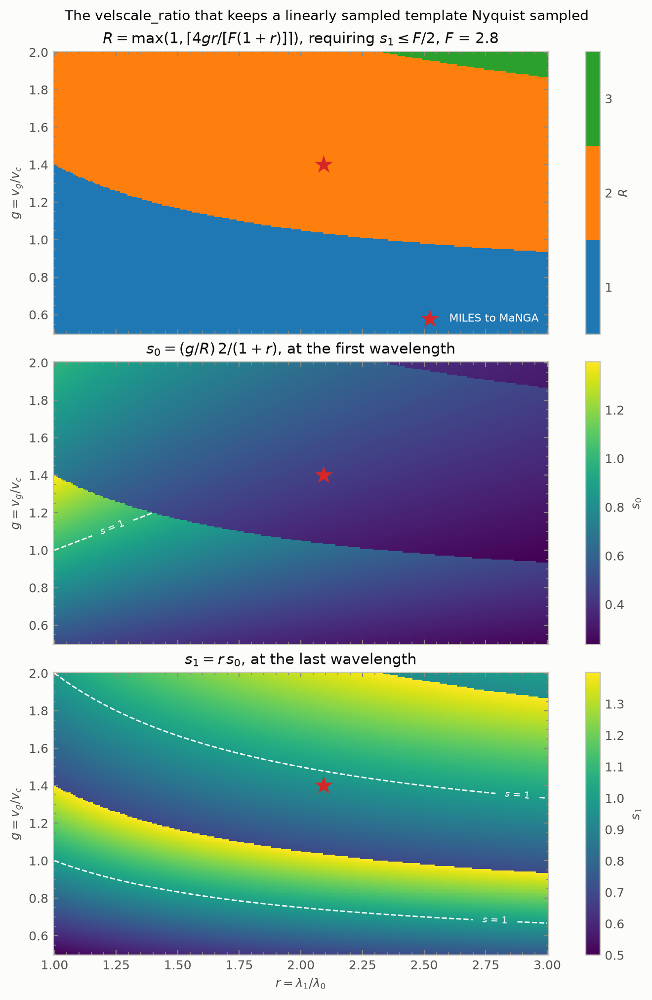
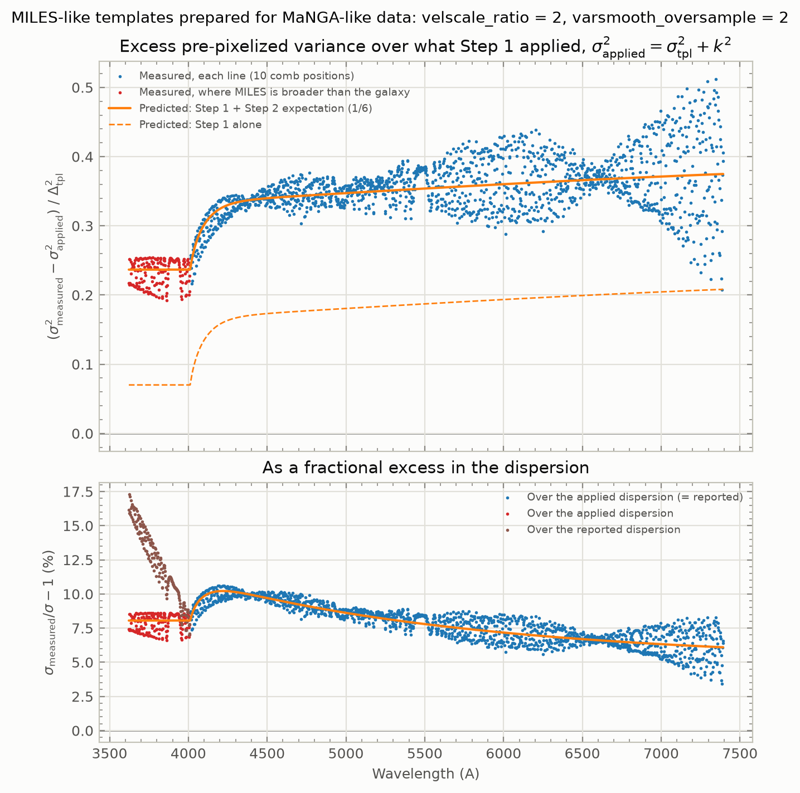
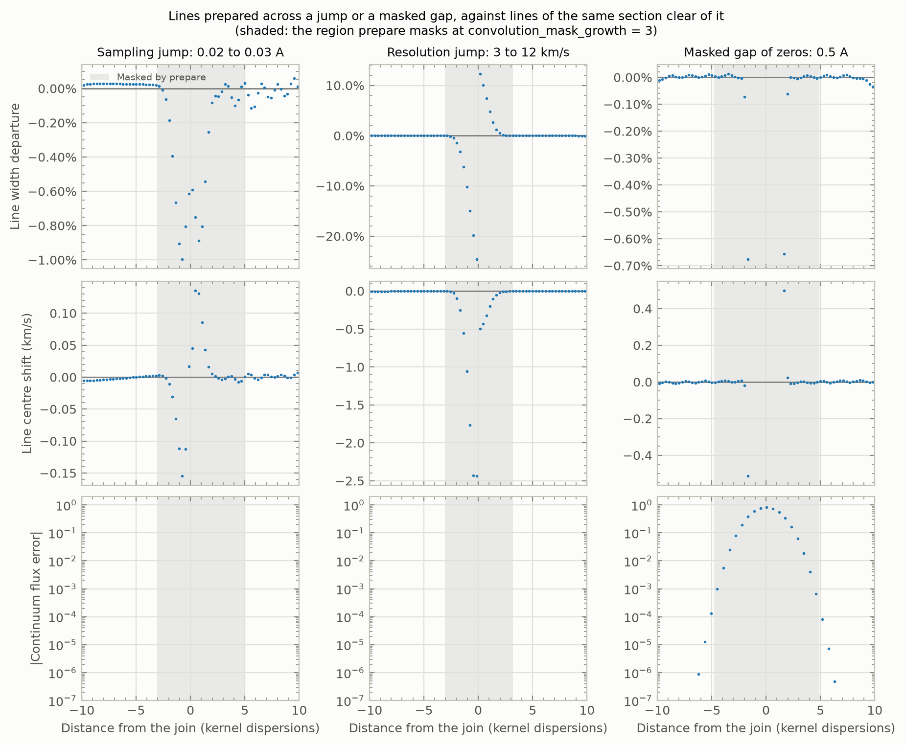
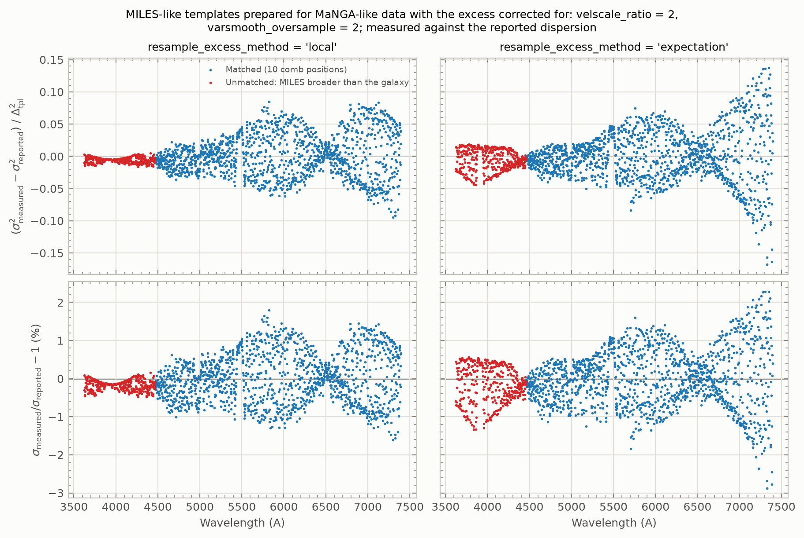

.. include:: ../include/links.rst

.. _dev-template-preparation:

=====================================
Characterizing template preparation
=====================================

``dc3`` prepares its stellar templates once per run, in two steps, before any
fitting begins (see :func:`~dc3.templates.prepare`):

===== =======================================================================
Step  Operation
===== =======================================================================
1     Match the templates' resolution to a fiducial galaxy resolution, less a
      constant instrumental variance ``dvar_inst``, by a variable-dispersion
      convolution (see :func:`~dc3.core.resolution.apply_kernel`, which
      primarily wraps ``ppxf_util.varsmooth``).
2     Resample onto the galaxy's logarithmic sampling, at an integer
      ``velscale_ratio`` (see :class:`~dc3.core.resample.Resample`).
===== =======================================================================

This page summarizes the numerical experiments that test what those two steps
do to the width of the templates' line-spread function, the correction
``prepare`` applies for it, and what follows for the instrumental correction
every dispersion ``dc3`` reports depends on.

Summary
=======

- **The bookkeeping assumption fails at both steps.** ``mangadap``, and ``dc3``
  without the correction below, assume Step 1 changes the pre-pixelized
  dispersion by exactly the convolution kernel in quadrature, and Step 2 not at
  all.  Each step instead adds about :math:`\Delta^2/6` of variance,
  :math:`\Delta` being the relevant pixel size, and both excesses are predicted
  analytically.
- **Uncorrected, MILES templates prepared for MaNGA data are 3–11% broader in**
  :math:`\sigma` **than** ``PreparedTemplates.idsp`` **reports**, 8% in the
  median.  The two predictions together account for the excess to within 0.002
  :math:`\Delta_{\rm tpl}^2` on average.  Neither ``velscale_ratio`` nor
  ``varsmooth_oversample`` removes it.
- ``prepare`` **now corrects for it, by default.**  The matching kernel is
  chosen so that both steps together reach the target, and where they cannot,
  the dispersion reported is the one achieved.  The prepared MILES templates
  then match what is reported to 0.02% in :math:`\sigma` in the median, within
  ±1.8% line to line.
- **Most linearly sampled libraries are resampled to output pixels smaller than
  their own** at the blue end, :math:`s < 1`, at the ratio that keeps them
  Nyquist sampled.  That adds covariance between template pixels, but makes the
  Step 2 excess more uniform, and so its correction more accurate.
- **The mask grown around a jump or a masked gap in a spliced library is wide
  enough.**  At either kind of jump, prepared lines depart from their unspliced
  width only within about 2.3 dispersions of the matching kernel, inside the
  default growth of three; next to a gap of zeros, the prepared continuum is
  wrong by at most :math:`1.3 \times 10^{-4}` outside the masked region.
- **Pixels masked in a library are convolved as they are, and the prepared
  templates are masked around them**, flagged ``TPL_MASKED``, since the
  convolution cannot carry a mask.  Their flux must be finite: a non-finite
  value is an error, to be rejected when a library is read, never a way of
  flagging a pixel.

Motivation
==========

The fit measures an observed dispersion :math:`\sigma_{\rm obs}` and converts it
to the astrophysical one with

.. math::

    \sigma_\ast^2 = \sigma_{\rm obs}^2 - {\rm dvar\_inst},
    \qquad
    {\rm dvar\_inst} = \sigma_G^2 - \sigma_{T'}^2,

where :math:`\sigma_G` is the galaxy's instrumental dispersion and
:math:`\sigma_{T'}` that of the *prepared* templates.  ``dvar_inst`` is chosen
during Step 1, such that it can be directly applied to the kinematic
measurements using the prepared templates.  However, this assumes that no
additional broadening is introduced beyond this nominal difference in
instrumental dispersion.

There are two reasons to expect such broadening:

- **Step 1 interpolates.**  ``varsmooth`` follows Cappellari (2023, Algorithm 1):
  it stretches the coordinate so the variable kernel becomes constant,
  convolves, and interpolates back.  Cappellari (2023, §3.1) notes that
  interpolation is itself a convolution but does not quantify it.
- **Step 2 resamples an already-pixelized spectrum.**  The array being resampled
  is the line-spread function already integrated over the template's own
  pixels, and ``Resample`` treats each input pixel as flat before integrating it
  over the output pixels.

The ``mangadap`` approach (primarily by oversight) assumed neither mattered, and
this was not addressed by Law et al. (2021).

This document describes six characterizations:

- Characterization 1 validates the measurement itself.
- Characterizations 2 and 3 quantify and predict the broadening of Steps 1 and
  2 separately.  Characterization 3 is accompanied by a calculation of the
  pixel-size ratios Step 2 meets in production.
- Characterization 4 tests the predictions through the whole pipeline, for MILES
  templates prepared for MaNGA data.
- Characterization 5 addresses template libraries built by splicing several
  spectral regions into a single spectrum, which potentially breaks the
  assumption, made by both steps, that the spectral sampling and resolution
  vary smoothly with wavelength.
- Characterization 6 repeats Characterization 4 with the correction for the
  broadening that ``prepare`` now applies by default.

Terms
=====

- **LSF**: Line-Spread Function

- **Pre-pixelized Instrumental Dispersion (or width)**: The :math:`\sigma` of
  the native Gaussian LSF, *before* integration over the pixel grid.

- **Post-pixelized Instrumental Dispersion (or width)**: The :math:`\sigma` of a
  Gaussian function fit to the profile produced by convolving a Gaussian LSF
  with a top-hat pixelization kernel.

- **Excess variance**: The variance a step adds to the pre-pixelized LSF beyond
  what it is meant to: for Step 1, beyond the kernel in quadrature; for Step 2,
  beyond nothing.  Reported in units of the relevant pixel squared.

The symbols used throughout:

- :math:`\Delta`: a pixel's width.  :math:`\Delta_{\rm tpl}` is the template
  library's native pixel; :math:`\Delta_{\rm in}` and :math:`\Delta_{\rm out}`
  are the input and output pixels of a resampling.  In velocity,
  :math:`v_{\rm pix}` is a pixel's width in km/s.
- :math:`k`: the dispersion of the Step 1 matching kernel, in native pixels.
  :math:`k_{\rm max}` is its largest value anywhere in the spectrum, and
  :math:`D = k_{\rm max}/k` the local dynamic range.
- :math:`m`: the oversampling of ``varsmooth``'s internal grid,
  ``varsmooth_oversample``.
- :math:`E_1(k)`: the excess variance of Step 1, in pixels squared
  (Characterization 2); :math:`g(k) = k^2 + E_1(k)`, the total variance the
  convolution applies.
- :math:`s = \Delta_{\rm out}/\Delta_{\rm in}`: the ratio of output to input
  pixel size in Step 2.  :math:`s = p/q` in lowest terms where it is rational.
- :math:`x`: the offset of the output grid relative to the input, as a fraction
  of an output pixel; :math:`\phi`: the fraction of the way into an input pixel
  at which an output border falls.
- :math:`E_2`: the excess variance of Step 2, in units of
  :math:`\Delta_{\rm in}^2` (Characterization 3).
- :math:`R`: ``velscale_ratio``, the number of prepared-template pixels per
  galaxy pixel.
- :math:`F`, :math:`r`, :math:`g`: the FWHM of the LSF in template pixels, the
  wavelength span :math:`\lambda_1/\lambda_0`, and the galaxy's velocity scale
  over that of the central template pixel, which set :math:`s` in production
  (Characterization 3).  This :math:`g` is not :math:`g(k)`; the context always
  distinguishes them.
- :math:`\sigma_G`, :math:`\sigma_{T'}`: the instrumental dispersions of the
  galaxy and of the prepared templates; ``dvar_inst``
  :math:`= \sigma_G^2 - \sigma_{T'}^2`, the signed instrumental variance
  (see Motivation).
- :math:`\epsilon_\sigma`: ``epsilon_sigma``, the smallest matching kernel, in
  pixels: 0.1 by default, ``varsmooth``'s own floor.

Methods
=======

Every characterization uses the same approach, adapted from Law et al. (2021,
AJ 161, 52; §3.4): build a spectrum of lines whose width is known, pass it
through the step under test, and measure the line widths of the processed
spectrum.

**Lines of known pre-pixelized width.**  Each line is a Gaussian integrated
exactly over each pixel (see :func:`~dc3.core.lsf.gaussian_comb`), so its
pre-pixelized dispersion -- the quantity every ``idsp`` vector in ``dc3``
describes -- is known by construction.

**Measuring the right width.**  Widths are measured by fitting a
*pixel-integrated* Gaussian (see :func:`~dc3.core.lsf.fit_line`), which returns
the pre-pixelized width.  A Gaussian evaluated at the pixel centres would return
the *post*-pixelized width, which is 1-10% broader for a critically sampled line
(Law et al. 2021, §3.2 and Figure 4): measuring that instead would build the
bias under study into the instrument used to study it.  Characterization 1
validates the choice.

**Sampling every pixel phase.**  Lines are spaced by an amount incommensurate
with the pixel size, so successive lines sit at different phases within their
pixels and one comb samples them all.  Characterizations 2 and 3 report a
median, or a mean, with its range over phase; Characterizations 4 to 6 show
every line, since there the spread over phase and position is itself a result.

**Units.**  Changes in variance are expressed in units of the relevant pixel
squared, so results from different samplings can be compared directly.  The
reference values :math:`\Delta^2/12` (the variance of a top-hat function with a
width, :math:`\Delta`, given by the span of one pixel) and :math:`\Delta^2/6`
(the variance of linear interpolation, a triangle one pixel wide on either side)
appear throughout.

Characterization 1: The relation between pre- and post-pixelized widths
=======================================================================

**Question.** Does the pixel-integrated fit recover a known pre-pixelized width,
and does the pixel-centre fit reproduce the published post-pixelized relation?

**Setup.** Single lines of pre-pixelized width 0.6-2.2 px, at eleven pixel phases,
fit both ways (``characterize_pixelization.py``).

**Result.** The pixel-integrated fit recovers the input width **to round-off**
at every phase.  The pixel-centre fit reproduces Law et al.'s polynomial for
:math:`\sigma_{\rm post}/\sigma_{\rm pre}` to **0.18%** over its range, and
follows :math:`\sigma_{\rm post}^2 \approx \sigma_{\rm pre}^2 + \Delta^2/12`
closely above about one pixel.  The setup is sound, and every later width is
measured with the pixel-integrated fit.

    *Top*: the ratio of post- to pre-pixelized width from a fit at the pixel
    centres, against Law et al.'s fit and the second-moment approximation.
    *Bottom*: the pixel-integrated fit recovers the input to round-off.

The scatter at the narrow end of the top panel is a dependence on pixel phase.
The post-pixelized width departs most from the second-moment prediction when
the line is centred on a pixel (phase 0 or 1), and least when it is centred on
a pixel border (phase 0.5).  The swing shrinks quickly as the line widens: from
0.77% at :math:`\sigma_{\rm pre} = 0.6` px to 0.03% at 0.9 px.  What remains
at 0.9 px is a nearly constant offset of about 0.13%, which reflects that a
Gaussian fit to the pixelized profile is not exactly its second moment.

    The post-pixelized width relative to the second-moment prediction,
    :math:`\sqrt{\sigma_{\rm pre}^2 + 1/12}`, against the phase of the line
    centre within its pixel, for four pre-pixelized widths.

Characterization 2: Step 1, resolution matching
===============================================

**Question.** Does the variable-dispersion convolution change the pre-pixelized
width by exactly the kernel, :math:`\sigma_{\rm out}^2 = \sigma_{\rm in}^2 +
k^2`?  If not, is the departure specific to the convolution ``dc3`` uses, and
can it be predicted?

**Setup.** Combs of lines at :math:`\sigma_{\rm in}` = 0.5, 1 and 2 px are
convolved on a single grid -- no resampling -- by five methods
(``characterize_matching.py``):

- ``varsmooth`` at ``oversample`` :math:`m` = 1, 2 and 4: the vector path of
  ``ppxf_util.varsmooth``, as :func:`~dc3.core.resolution.apply_kernel` calls
  it.  It stretches the coordinate so the kernel becomes uniform, interpolates
  the spectrum linearly onto the stretched grid, convolves by FFT with the
  analytic Gaussian transform, and interpolates back.  :math:`m = 1` is no
  longer allowed (see below) and is included for comparison.
- ``varsmooth`` given a *scalar* dispersion: a single FFT convolution, with no
  stretch and no interpolation.  Possible only for a uniform kernel.
- ``ppxf_util.gaussian_filter1d``: a direct sum over a Gaussian sampled at
  whole-pixel offsets, with no interpolation.  Deprecated upstream (by ``ppxf``)
  in favour of ``varsmooth``.

Each is applied with a *uniform* kernel at widths of 0.1-10 px, and with a
*varying* kernel that rises geometrically from 0.1 to 10 px along a
60,000-pixel spectrum.  The excess variance beyond quadrature addition is
measured three ways: with the pixel-integrated Gaussian fit used throughout
this page; with the second moment of the samples; and with a kinematic-style
fit that convolves the *input* line with a Gaussian of free dispersion
:math:`s` and fits the output line, as a kinematic measurement does, giving
:math:`s^2 - k^2`.

**Result.** No: ``varsmooth``'s vector path broadens every line beyond the
kernel, by about :math:`\Delta^2/6` once the kernel exceeds half a pixel and
by more where the kernel is near its widest.  The excess is specific to its
interpolation, and it is predicted exactly.

    The excess variance beyond quadrature addition.  *Top*: a uniform kernel,
    against its width; ``varsmooth`` at :math:`m = 1` lies under the scalar
    path, both being zero.  *Middle*: the varying kernel, against the local
    width.  *Bottom*: the varying kernel, against the local dynamic range
    :math:`D = k_{\rm max}/k`.  Solid lines, with their 16th-84th percentile
    bands over pixel phase, are the Gaussian fit; dotted lines the second
    moment; dashed lines the predictions of the second moment.  The
    ``gaussian_filter1d`` second moment falls at large :math:`k` in the top row
    because that function truncates its kernel.

The prediction
--------------

``varsmooth`` acts on the samples as a discrete kernel, and a discrete kernel
adds exactly its own variance to the second moment.  Its interpolation onto the
stretched grid reconstructs the spectrum with the hat function of linear
interpolation, :math:`\Lambda`, of variance :math:`\Delta^2/6`; the result is
convolved with the Gaussian and sampled back at whole pixels.  Sampling
:math:`\Lambda \otimes G_k` at whole pixels loses part of its variance, which
Poisson summation gives in closed form.  The return interpolation, from a
stretched grid whose spacing is :math:`\Delta/(mD)`, adds a further term.  In
units of :math:`\Delta^2`,

.. math::

    \sigma_{\rm out}^2 - \left(\sigma_{\rm in}^2 + k^2\right)
    = \frac{1}{6}
    - \frac{1}{\pi^2} \sum_{p \geq 1} \frac{e^{-2\pi^2 p^2 k^2}}{p^2}
    + \frac{1}{6 (mD)^2},
    \qquad
    D = \frac{k_{\rm max}}{k},

with :math:`k` in pixels.

- **The sum** is the fall-off for small kernels.  It takes the excess to zero
  as :math:`k \to 0` -- sampling the bare hat function at whole pixels returns
  the original samples -- and has vanished by :math:`k \approx 0.5` px, where
  the excess reaches :math:`1/6`.  It is the Gaussian's transform,
  :math:`e^{-2\pi^2 k^2}` at the pixel aliases, that sets it, not the accuracy
  of the transform on the stretched grid, where the kernel always spans
  :math:`m\,k_{\rm max}` samples and is well resolved.
- **The last term depends on the local dynamic range** :math:`D`, the widest
  kernel *anywhere in the spectrum* relative to the local one, not on
  :math:`k` itself; ``varsmooth`` sizes its stretched grid from the widest
  kernel.  So the extra broadening concentrates where the matching kernel is
  at its widest, reaching :math:`(1/6)(1 + 1/m^2)` there: 0.33 px² at
  :math:`m = 1` and 0.21 px² at :math:`m = 2`.  Holding the local kernel
  fixed and varying only its maximum elsewhere confirms the dependence.
- **A uniform kernel is the exception.**  Its stretched grid lines up with the
  pixels, and the excess is :math:`(1 - 1/m^2)/6` instead: 0 at :math:`m = 1`,
  0.125 at 2, and 0.156 at 4, as the top row shows.

The second moment follows this to four decimal places at every input width,
for both the uniform and the varying kernels.

The second moment and the fitted width
--------------------------------------

The fits see less than the second moment where the kernel is small and the
line narrow.  The effective kernel, :math:`\Lambda \otimes G_k` sampled at whole
pixels, is not Gaussian: it carries extra weight in its wings, which a Gaussian
model only partly registers.  At :math:`k = 0.2` px the second moment rises by
0.12 px² whatever the line width, but the Gaussian fit reports 0.07, 0.10 and
0.11 px² for :math:`\sigma_{\rm in}` = 0.5, 1 and 2 px.  Above about half a
pixel the two agree.

**The kinematic-style fit reports the same excess as the Gaussian fit**, to
0.001 px² for lines of 1 px and wider, at every kernel and for every method.  A
kinematic measurement convolves a template with a Gaussian broadening function
rather than fitting a profile to the observed line, so this is the quantity it
responds to -- and the pixel-integrated Gaussian fit, used for every other
characterization on this page, already measures it.  The prediction is exact for
the second moment; however, for narrow template lines, the effect seen for the
kinematics-style fit is modestly lower.

``varsmooth`` and ``gaussian_filter1d``
---------------------------------------

Neither ``gaussian_filter1d`` nor ``varsmooth``'s scalar path interpolates, and
neither adds the :math:`\Delta^2/6`: both are exact once the kernel exceeds
about a pixel.  The excess is a property of ``varsmooth``'s
stretch-and-interpolate design, not of convolution on a sampled grid.

``gaussian_filter1d`` has its own defect below a pixel.  Its kernel is a
Gaussian sampled at whole pixels and normalized, whose variance falls short of
:math:`k^2` when undersampled -- by 0.04 px² at :math:`k = 0.2` px and up to
0.09 px² near 0.35 px -- again exactly as predicted (dashed).  ``varsmooth``'s
use of the analytic transform avoids that, which is why ``ppxf`` prefers it;
the price is the interpolation excess.

The shift of the line centre
----------------------------

A kernel that varies along the spectrum also *moves* lines, towards the side
where the kernel is wider: a line is spread more on that side.  To first order
in the kernel gradient its first moment moves by :math:`2kk'`, whatever the
method, where :math:`k' = dk/dx` is the gradient of the kernel dispersion with
pixel position :math:`x`, both in pixels, so that the shift is in pixels; a
uniform kernel moves nothing.  For the varying kernel here, which rises
geometrically from :math:`k_{\rm min}` to :math:`k_{\rm max}` over :math:`N`
pixels, :math:`k' = k \ln(k_{\rm max}/k_{\rm min})/(N - 1)`, so the shift grows
as :math:`k^2`.

    The shift of the line centre under the varying kernel, against the kernel
    width (*top*) and the local dynamic range (*bottom*).  Solid lines, with
    their 16th-84th percentile bands, are the kinematic-style fit; dotted lines
    the first moment; the black dashed line the prediction :math:`2kk'`.

``gaussian_filter1d`` follows :math:`2kk'` exactly; ``varsmooth`` moves the
first moment somewhat less, about 0.009 px at :math:`k \approx 9` px against
0.012 px predicted.  The fits see about half of the first-moment shift, 0.003
to 0.005 px there, and the Gaussian fit agrees with the kinematic-style fit.
For this test kernel, which rises a hundredfold across the spectrum,
:math:`kk'` is far larger than in a real preparation, where the resolution
varies slowly; the shift is then much smaller still, but it is systematic in
sign, and so would appear in a velocity zero point rather than averaging away.

Choices that follow
-------------------

**Never a scalar dispersion.**  ``varsmooth`` is always given a vector of
kernel dispersions, never a single value.  The scalar path is free
of the interpolation excess, but every preparation in which the kernel varies
must use the vector path, so preparing a uniform kernel through the scalar path
would make the result depend on whether the kernel happened to be uniform.
:func:`~dc3.core.resolution.apply_kernel` always passes a vector, and in
pixel coordinates, so that the conversion of the kernel to pixels is exact on
any grid.

**The oversampling must be at least 2.**  At :math:`m = 1` a uniform kernel is
applied exactly while one that varies even slightly is broadened by up to
:math:`\Delta^2/3`; the top row shows the uniform case at zero and the middle
row the varying one at up to 0.30 px².  With :math:`m \geq 2` the uniform case
lies at 0.125-0.164 px², within 0.04 px² of the varying one and of
:math:`\Delta^2/6`, and the dynamic-range term is at most :math:`\Delta^2/24`.
``TemplatePar.varsmooth_oversample`` therefore defaults to 2 and refuses less,
as does ``apply_kernel``.  Its cost is about twice that of :math:`m = 1`, which
is immaterial given that templates are prepared once per execution of ``dc3``.

Behind the uniform case lies an upstream defect: given an exactly uniform
kernel, ``varsmooth`` builds its stretched grid one sample short and broadens
the result.  ``apply_kernel`` works around it by raising the largest element of
the kernel by a hundredth of a stretched sample, which changes a convolved
spectrum by a few parts in :math:`10^7`; the defect has been reported upstream.

Characterization 3: Step 2, resampling
======================================

**Question.** Does resampling leave the pre-pixelized width unchanged?

**Setup.** Combs at 1 and 2 input pixels, resampled onto grids whose pixel is
1/4 to 4 times the input's, at offsets of the output grid relative to the input
from 0 to 1 output pixel in steps of 0.05 (``characterize_resampling.py``).  The
offset matters because production does not control it: it follows from the
templates' and the galaxy's starting wavelengths.  The measurements take about
five minutes; ``--replot`` redraws the figure from the tables a previous run
wrote.

**Result.** No.  Step 2 adds a median of **about** :math:`\Delta_{\rm in}^2/6`,
independent of the input width and of the pixel-size ratio over the whole
range.  It is **zero only where the two grids are aligned at an integer
ratio**, and otherwise ranges from 0 to 0.28 :math:`\Delta_{\rm in}^2` with the
grid offset.

**Why.** ``Resample`` treats each input pixel as flat, and that is all it takes
to predict the excess exactly.  Work in input pixels, :math:`\Delta_{\rm in} =
1`, and let :math:`x` be the offset of the output grid as a fraction of an
output pixel.

*Integer* :math:`s`.  Every output border falls the same fraction
:math:`\phi = {\rm frac}(s x)` of the way into an input pixel.  An output pixel
therefore collects :math:`1 - \phi` of the first input pixel it overlaps, all of
the :math:`s - 1` between, and :math:`\phi` of the last.  Each output value is
the line integrated against the same window, which is a box of width :math:`s`
convolved with a two-point kernel: weight :math:`1 - \phi` at 0 and :math:`\phi`
at 1.  The box is the output pixel the fit already models.  The two-point kernel
is linear interpolation at fraction :math:`\phi`; its mean, :math:`\phi`, only
shifts the line, and its variance is the excess:

.. math::

    \frac{\Delta\sigma^2_{\rm pre}}{\Delta_{\rm in}^2} = \phi\,(1 - \phi).

This is zero where the grids align, and peaks at **1/4** midway between, for
*any* integer :math:`s`; the :math:`s` arches across one output pixel of
offset are the integer curves in the top panel.

*Rational* :math:`s = p/q`, *in lowest terms*.  :math:`\phi` is no longer the same
for every output pixel, but cycles through :math:`q` equally spaced values.  A
line spanning several output pixels sees their average, which is

.. math::

    \frac{\Delta\sigma^2_{\rm pre}}{\Delta_{\rm in}^2}
        = \frac{1}{6} - \frac{1 - 6\,\phi'(1 - \phi')}{6q^2},
    \qquad \phi' = {\rm frac}(p\,x).

The oscillation has amplitude :math:`1/(4q^2)` about a baseline of
:math:`1/6 - 1/(6q^2)`, repeated :math:`p` times across one output pixel of
offset: 0.125 to 0.1875 for :math:`s` = 0.5 and 1.5.  As :math:`q` grows the
oscillation vanishes, leaving **1/6**, the mean of :math:`\phi(1 - \phi)` over a
uniform :math:`\phi`.

*Uniform offset.*  Production does not control :math:`x`, so take it uniform on
[0, 1).  Then :math:`\phi'` is uniform too, and the excess has

.. math::

    \min = \frac{1}{6} - \frac{1}{6q^2},
    \qquad
    \langle \Delta\sigma^2_{\rm pre} \rangle = \frac{1}{6},
    \qquad
    \max = \frac{1}{6} + \frac{1}{12q^2},

in units of :math:`\Delta_{\rm in}^2`: the **expectation is 1/6 at every**
:math:`s`, and only the range about it depends on :math:`s`.

*The limitation to rational* :math:`s`.  The prediction holds only for a
rational :math:`s`, and only for a line spanning many cycles of :math:`\phi`.
Near a simple ratio :math:`p/q`, :math:`\phi` drifts slowly from one output
pixel to the next, so a line of finite width sees only part of a cycle, and an
excess nearer :math:`\phi(1 - \phi)` at its local phase.  The measured range
is therefore wide, nearly 0 to 1/4, for any :math:`s` near 1, 2, 3 or 4, not
only at those values, while the prediction for :math:`q \to \infty` is 1/6 alone.
How near is near depends on how many output pixels a line spans, and so on
:math:`\sigma_{\rm in}/s`.  The bottom panel accordingly shows the prediction
only at rational :math:`s`, in steps of 1/12.

The prediction is exact for the second moment.  The Gaussian fit follows it to
within 0.002 :math:`\Delta_{\rm in}^2` once :math:`\sigma_{\rm in} \gtrsim 4`
input pixels.  At :math:`\sigma_{\rm in}` = 1, as in the top panel, the fit
departs from it, as it does for the narrow lines of Characterization 2: there
the convolved line is a blend of two Gaussians one input pixel apart, and is
only :math:`\sigma_{\rm in}/s` output pixels wide.  At :math:`\phi = 1/2` the fit
reports 0.278, 0.267 and 0.247 for :math:`s` = 1, 2 and 3, against 0.25.

    *Top*: the change in pre-pixelized variance against the offset of the
    output grid, for several pixel-size ratios :math:`s`: the median over line
    phase (points) and the prediction above (lines).  *Bottom*: against
    :math:`s`, the mean (solid) and extremes (dashed) over the same 21 grid
    offsets and every line phase, for each input width; and, as black bars,
    the predicted range over a uniform grid offset at :math:`s = k/12`, whose
    expectation is the 1/6 reference line.

The range of :math:`s` in production
------------------------------------

Most template libraries are sampled linearly in wavelength, and the galaxy
logarithmically, so :math:`s` is not one number: it rises along the spectrum.
Three unitless quantities set it (``characterize_velscale.py``):

- :math:`F`, the FWHM of the line-spread function being resampled, in template
  pixels, taken as constant;
- :math:`r = \lambda_1/\lambda_0`, the wavelength span of the library;
- :math:`g = v_g/v_c`, the galaxy's velocity scale over that of the template
  pixel at the centre of the library, :math:`v_c = c\,\Delta\lambda_{\rm
  in}/\lambda_c`, with :math:`\lambda_c = (\lambda_0 + \lambda_1)/2`.

To first order in :math:`v/c`, :math:`s(\lambda) = (g/R)\,\lambda/\lambda_c`, so
at the first and last wavelengths

.. math::

    s_0 = \frac{g}{R}\,\frac{2}{1 + r},
    \qquad
    s_1 = r\,s_0.

The line-spread function spans :math:`F/s` output pixels, so Nyquist sampling
requires :math:`s \leq F/2`.  Only the red end constrains :math:`R`, giving

.. math::

    R = \max\left(1, \left\lceil \frac{4gr}{F(1 + r)} \right\rceil\right),

the same as :func:`~dc3.core.resolution.minimum_velscale_ratio` gives for that
line-spread function.

**Which line-spread function.**  The map takes :math:`F` to be the library's
*own* resolution, :math:`F = 2.8` for MILES (2.51 Å FWHM in 0.9 Å pixels): the
ratio that would keep the library Nyquist sampled if it were resampled at its
native resolution.  That is not what ``prepare`` resamples.  Step 1 runs first,
so the templates Step 2 resamples carry the matched resolution, which is broader
wherever the galaxy's is, and ``velscale_ratio = 'auto'`` tests that.  The map's
:math:`R` is therefore an upper bound on what ``'auto'`` selects, reached only
where matching leaves the templates' resolution near their red end unchanged.
For MILES prepared for MaNGA (:math:`r` = 2.09, :math:`g` = 1.40), the map gives
:math:`R` = 2.  But at the red end of MILES, 7410 Å, the matched dispersion is
63 km/s against MILES's 43 km/s, or :math:`F` = 4.1 rather than 2.8, so
``'auto'`` selects :math:`R` = 1, with :math:`s` from 0.93 to 1.89.

Over :math:`1 \leq r \leq 3` and :math:`0.5 \leq g \leq 2`, the map's choice
gives :math:`0.23 \leq s \leq 1.4` at :math:`F` = 2.8.  A broader matched
resolution allows a smaller :math:`R`, and so :math:`s` up to :math:`F/2` --
1.9 for MILES and MaNGA at :math:`R` = 1.  Characterization 3 spans 1/4 to 4,
which covers both comfortably.

Covariance between output pixels sets a second, lower bound, :math:`s \gtrsim
1`.  Both bounds can be met everywhere only if :math:`r \leq F/2`, i.e.
:math:`r \lesssim 1.4` for MILES-like sampling.  Over most of the map
:math:`s_0 < 1`: at the blue end of a prepared library the output pixels are
generally smaller than the input pixels, and neighbouring output pixels are
correlated.

That is not all cost.  The results above show that for :math:`s < 1` the
Step 2 excess stays close to its expectation of 1/6 whatever the grid offset,
except near simple ratios such as 1/2, whereas near an integer :math:`s` it
ranges from 0 to 1/4.  A prepared library whose output pixels are smaller than
its native pixels therefore has more uniform widths, and a correction for them
is more accurate.  For MILES prepared for MaNGA, ``velscale_ratio = 2``
(:math:`0.46 \leq s \leq 0.95`) halves the line-to-line scatter of the excess
compared with the ``velscale_ratio = 1`` that ``'auto'`` selects
(:math:`0.93 \leq s \leq 1.89`), for the same mean.  That is why
Characterizations 4 and 6 set 2 explicitly.

    For a library of constant FWHM, :math:`F` = 2.8 pixels, against the span
    :math:`r` and the scaled galaxy velocity scale :math:`g`.  *Top*: the ratio
    :math:`R` that keeps the red end of the library, at its own resolution,
    Nyquist sampled; an upper bound on what ``velscale_ratio = 'auto'``
    selects, since Step 1 broadens the templates first.  *Middle* and *bottom*:
    the pixel-size ratio it gives at the first and last wavelengths, with the
    contour :math:`s = 1`.  The star marks MILES resampled to the MaNGA
    sampling.

Characterization 4: the whole pipeline
======================================

**Question.** Through :func:`~dc3.templates.prepare`, *without* the correction
described below (``correct_lsf_excess = False``), do the predictions of
Characterizations 2 and 3 account for the width of the prepared templates?  And
what does that mean, concretely, for the resolution of a real library prepared
for real data?

**Setup.** The concrete case is the MILES library prepared for MaNGA
(``characterize_preparation.py``):

- *Templates*: a comb of lines with the MILES sampling and resolution -- 4300
  linear pixels of 0.9 Å from 3540.5 Å, at a constant FWHM of 2.51 Å (1.18
  native pixels in :math:`\sigma`).  Lines are 23.37 pixels apart, at least 5.3
  FWHM after preparation, so they never blend.
- *Galaxy*: MaNGA-like, simplified to a sampling of :math:`\Delta\log_{10}\lambda
  = 10^{-4}` (69 km/s) from 3622 to 10354 Å, and a dispersion falling linearly
  from 80 km/s at 4000 Å to 55 km/s at 9000 Å.
- *Preparation*: ``velscale_ratio = 2`` and the default ``varsmooth_oversample =
  2``.  The pixel-size ratio then runs over :math:`0.46 \leq s \leq 0.95`, where
  the Step 2 excess stays near its expectation; see the range of :math:`s` in
  production above.  ``'auto'`` would choose 1, since it accounts for Step 1
  broadening the templates to the galaxy's resolution first; the mean excess is
  the same, but its scatter doubles.

The comb is prepared at ten positions, each shifted by a tenth of the line
spacing, for 1794 lines in all.  Each is measured by a pixel-integrated
Gaussian fit and compared with the dispersion Step 1 *applied*,
:math:`\sigma_{\rm applied}^2 = \sigma_{\rm tpl}^2 + k^2`, with :math:`k` the
matching kernel as ``varsmooth`` clips it.

**The applied and reported dispersions.**  Wherever the matching succeeds,
:math:`\sigma_{\rm applied}` is what ``PreparedTemplates.idsp`` reports.  Below
about 4000 Å it is not: there MILES is *broader* than the galaxy, the kernel
that would match them does not exist, and at the default ``sigma_floor = 0`` it
is held at its floor.  The prepared templates then keep the MILES resolution
(88 km/s at 3622 Å), while ``idsp`` still reports the galaxy's (82 km/s).  That
gap is a separate matter from Steps 1 and 2, so the excess is measured against
the applied dispersion, and the excess over the reported one is shown
separately.  It belongs to the uncorrected pipeline: with the correction
described below, the default, ``idsp`` reports what the templates actually
carry there.

**The prediction** is the sum of the two steps' excesses, in units of the
native template pixel squared: :math:`E_1` of Characterization 2, evaluated at
the local kernel, plus the expectation of 1/6 of Characterization 3.

**Result.** The predictions account for the full pipeline.

- Measured minus predicted is **+0.002** :math:`\Delta_{\rm tpl}^2` in the mean
  and median, with a 16–84% range of :math:`\pm 0.03`.  The total excess is
  0.34 :math:`\Delta_{\rm tpl}^2`, about half from each step.
- In :math:`\sigma`, the prepared templates are **3–11% broader** than the
  dispersion Step 1 applied, **8%** in the median.  Below 4000 Å they are up to
  **17% broader than reported**, the matching gap adding to the steps' excess.
- The scatter is Step 2's dependence on grid offset.  It is smallest where
  :math:`s` is far from a simple ratio (4300–5000 Å, :math:`s \approx
  0.55`–0.64), wider near :math:`s = 3/4` (about 5860 Å), and widest as
  :math:`s \to 1` at the red end.
- At 4000–4300 Å the measurement falls 0.007–0.010 :math:`\Delta_{\rm tpl}^2`
  below the prediction.  That is the shortfall of the Gaussian fit at small
  kernels of Characterization 2: Step 1 alone, measured on the native grid,
  shows it too, while the second moment there agrees with :math:`E_1` to
  0.002.

    MILES-like templates prepared for MaNGA-like data.  *Top*: the excess
    pre-pixelized variance of each prepared line over the dispersion Step 1
    applied, with the predicted total and the Step 1 term alone.  *Bottom*: the
    same as a fractional excess in :math:`\sigma`, and, where MILES is broader
    than the galaxy (red), the excess over the reported dispersion as well
    (brown).

Characterization 5: jumps and masked gaps in a spliced library
==============================================================

**Question.** Some libraries are spliced from sections sampled, or observed,
differently, and the pixels between the sections may be missing, padded and
masked.  The resolution-matching convolution cannot treat any of these
correctly.  How does ``prepare`` handle them, and is the region it masks wide
enough?

**What prepare does.**  The convolution spreads every pixel over the kernel's
footprint, masked or not, and a mask cannot be carried through it.  So
``prepare`` neither models these regions nor interpolates over them: it
convolves the library as it is, and masks the *prepared* templates around each
region, grown by ``convolution_mask_growth`` dispersions of the matching kernel
either side.  The kernel used is the largest across the region and the pixel
either side of it, and the growth is never less than one native pixel, which
still catches an output pixel straddling the region's edge.  Three kinds of
region are grown, each flagged with its own bit:

- a jump in the library's *sampling*, found with ``sampling_jump_tol``, flagged
  ``SAMP_JUMP``.  Pixel space treats pixels of two sizes as equal across it.
- a jump in the library's *resolution*, found with ``idsp_jump_tol``, flagged
  ``RES_JUMP``.  The coordinate stretch of the variable-dispersion convolution
  changes abruptly across it.
- a run of pixels *masked in the library itself*, in each template separately,
  flagged ``TPL_MASKED``.  Their flux is convolved in like any other.

Interpolating over a masked run would only be needed if its flux were not
finite, since a single non-finite value makes the whole convolved spectrum
non-finite.  ``dc3`` never uses a non-finite value to flag a pixel -- that is
what the mask is for -- so non-finite flux is to be rejected when a library is
read, and ``prepare`` does not handle it.  Nor does ``prepare`` check for
extreme finite values in masked pixels; that too belongs to reading a library.

**Setup.** Three experiments, each isolating one kind of region at 4025 Å
(``characterize_splices.py``):

- *Sampling*: a linear library whose pixel changes from 0.02 to 0.03 Å, at
  constant resolution.
- *Resolution*: a linear library at 0.02 Å throughout, whose resolution steps
  from 3 to 12 km/s.
- *Masked gap*: a linear library at 0.02 Å and constant resolution, with a gap
  of 0.5 Å whose pixels are set to zero and masked, as a gap padded with zeros
  would be.

Each line is integrated over its pixels' actual borders, so it is exact on
either side of a jump and across it.  A hundred combs, each offset slightly,
sample the distance from the region at about 0.3 kernel dispersions.  Every
library is prepared at ``prepare``'s defaults, with the correction for the
excess broadening described below.  The galaxy's resolution is constant near
the region, so the matching kernel is too, at about 13 km/s.  Each line's width is compared with what ``prepare``
reports, relative to lines of its own section clear of the region, which
removes the ordinary excess of Characterizations 2 and 3, :math:`E_1 + 1/6`,
and leaves only the region's effect.

The combs lie on a zero background, so they show what a region does to the
lines' own profiles.  A gap of zeros does its main damage to the *continuum*,
whose deficit the convolution spreads over the kernel's footprint.  So a flat
continuum of unit flux is also prepared through each experiment, and the
fractional error of its prepared flux is measured.  Preparation is linear in
the flux, so that error adds to any template's prepared flux, whatever its
lines.

**Result.**

=========== ======================== ======================== ======================
Region      Width departs by > 0.3%  Inside the masked region Outside it
=========== ======================== ======================== ======================
Sampling    −1.7 to +1.4 kernel σ    1.0% in width, 0.16 km/s < 0.12%, < 0.01 km/s
Resolution  −2.3 to +2.0 kernel σ    25% in width, 2.4 km/s   < 0.04%, < 0.01 km/s
Masked gap  −1.7 to +1.7 kernel σ    0.7% in width, 0.51 km/s < 0.04%, < 0.02 km/s
=========== ======================== ======================== ======================

- **The default growth covers the affected region with some margin.**  A growth
  of two dispersions would leave departures of a few tenths of a per cent at
  its edges.
- **A resolution jump is far the most damaging to the lines.**  Inside the
  masked region they are broadened or narrowed by up to a quarter, and shifted
  by up to 2.4 km/s.
- **A gap of zeros damages the continuum instead.**  The gap's edges lie at
  ±1.4 kernel dispersions.  The continuum error falls from 82% at the gap's
  centre to :math:`10^{-3}` about 3 dispersions beyond its edges.  Outside the
  masked region it is at most :math:`1.3 \times 10^{-4}`.  Neither jump changes
  a flat continuum beyond round-off.

One inefficiency, not a defect: the growth is set in native pixels of the wider
kernel, so on the coarser side of a sampling splice it reaches 4.9 rather than 3
kernel dispersions.

    Against the distance from a sampling jump (left), a resolution jump
    (middle) and a masked gap of zeros (right): the departure in width (top)
    and the shift in centre (middle) of prepared lines, and the fractional
    error of a prepared flat continuum (bottom).  Shaded: the region
    ``prepare`` masks at the default ``convolution_mask_growth = 3``.

Correcting the prepared resolution
==================================

Characterizations 2–4 show that each step broadens the templates' line-spread
function beyond what it is asked to, by an amount that is predicted.  So
``prepare`` corrects for both, by default (``correct_lsf_excess = True``), in
the second moment of the line-spread function.  The two corrections are made
differently, because the two excesses are different in kind.

**Step 1: in the resolution matching.**  Matching has an explicit goal, the
target resolution, and the excess of ``varsmooth`` is a failure to reach it.  So
the correction belongs in the matching itself, so that the target is *achieved*
rather than corrected for afterwards.  Given ``varsmooth_oversample``,
:func:`~dc3.core.resolution.match_resolution` chooses the kernel :math:`k` (in
pixels) whose variance *with* the convolution's own excess makes up the
difference:

.. math::

    g(k) \equiv k^2 + E_1(k) = \frac{\sigma_{\rm to}^2 - \sigma_{\rm from}^2
    - {\rm dvar\_inst}}{v_{\rm pix}^2},

with :math:`E_1` the prediction of Characterization 2
(:func:`~dc3.core.resolution.varsmooth_excess`).  :math:`g` increases
monotonically, from about 0.08 at the 0.1-pixel floor to :math:`k^2 + 1/6` for a
wide kernel, so it is inverted by interpolating a table of it.  :math:`E_1`
depends on the widest kernel, through :math:`D = k_{\rm max}/k`, so the kernel is
solved for iteratively.  The smallest variance the matching can add becomes
:math:`g(\epsilon_\sigma)` rather than :math:`\epsilon_\sigma^2`, which enters
the offset, and the unmatched pixels.  The correction is optional, so that the
uncorrected pipeline -- Characterization 4 -- can still be reproduced.

**Step 2: in the target passed to the matching.**  ``Resample``'s excess is an
artifact of its algorithm, not a failure of an explicit goal: it resamples, and
has no target resolution.  So the effect is documented in
:class:`~dc3.core.resample.Resample`, and ``prepare``, which knows both grids,
accounts for it.  The output grid depends on the grids alone, never on the flux,
so ``prepare`` predicts the variance Step 2 will add, at each native pixel,
*before* Step 1, and matches to the target less it:

.. math::

    \sigma_{\rm to}^2 = \sigma_{\rm target}^2 - E_2\,\Delta_{\rm tpl}^2.

:func:`~dc3.core.resolution.match_resolution` is never told about the
resampling.  ``resample_excess_method`` sets how :math:`E_2` is predicted:

- ``'expectation'``: the expectation over a uniform offset between the grids,
  1/6 at every wavelength (Characterization 3).
- ``'local'``, the default: :math:`\phi(1 - \phi)` at each output border, from
  the fraction :math:`\phi` of the way into its native pixel at which it
  actually falls, averaged over the borders a line spans.  The average is
  weighted by a Gaussian of the line's dispersion in output pixels, since a
  border contributes in proportion to the line flux it splits.  It follows the
  slow drift of :math:`\phi` near a simple ratio, which the expectation cannot,
  and is exact where the grids align: zero for coincident borders, 1/4 for
  borders midway through each native pixel.  Unlike :math:`E_1` and the
  rational-:math:`s` formula, the weighting is not derived: it is a plausible
  model, which reduces to both limits and is supported empirically by
  Characterization 6.

The output sampling itself, including ``velscale_ratio = 'auto'``, is chosen
from the nominal prepared resolution, the target offset by an uncorrected
``dvar_inst``, so the corrections do not change it.

**Where the target cannot be reached.**  The correction makes the pipeline's
smallest possible broadening larger, at :math:`g(\epsilon_\sigma) + E_2` rather
than :math:`\epsilon_\sigma^2`.  Wherever the templates with that broadening are
already broader than the target, no kernel reaches it.  The existing machinery
handles this unchanged: the offset absorbs it up to ``sigma_floor``, and the
remaining pixels are held at the floor kernel and recorded as unmatched, in
:attr:`~dc3.core.resolution.ResolutionMatch.unmatched`.  They are kept by
default; ``mask_unmatched_idsp`` masks them in the prepared templates, with the
``UNMATCHED`` bit.  What changes is **what is reported**.
``PreparedTemplates.idsp`` is now the dispersion the templates actually carry --
their own, with the floor kernel's :math:`g(\epsilon_\sigma)` and the Step 2
excess -- rather than the target they did not reach; this is
:attr:`~dc3.core.resolution.ResolutionMatch.achieved`, with the Step 2 excess
added.  Where no matching is performed at all, the templates' own dispersion is
likewise reported with the Step 2 excess.  For MILES prepared for MaNGA at the
default ``sigma_floor = 0``, the unmatched region extends from below 4000 Å,
uncorrected, to about 4460 Å.

Characterization 6: the corrected pipeline
------------------------------------------

**Setup.** Characterization 4 repeated exactly -- MILES-like templates prepared
for MaNGA-like data at ``velscale_ratio = 2``, over ten comb positions -- with
the correction on, for both ``resample_excess_method`` options
(``characterize_correction.py``).  Each line is compared with the dispersion
``prepare`` *reports*.

**Result.**  The prepared templates carry the reported resolution.

====================== ============================= ===============================
Method                 Matched lines                 Unmatched lines
====================== ============================= ===============================
``'local'``            −0.02% median, −1.6 to +1.8%  −0.15% median, −0.5 to +0.2%
``'expectation'``      −0.01% median, −2.9 to +2.3%  −0.12% median, −1.3 to +0.6%
====================== ============================= ===============================

In units of :math:`\Delta_{\rm tpl}^2`, the mean departure is +0.002 over
matched lines and −0.006 over unmatched lines, against the +0.34 left
uncorrected.

- **The local method earns its place where the phase drifts slowly**, that of
  :math:`\phi`: near :math:`s = 1/2` at the blue end, and as :math:`s \to 1` at
  the red end, where
  the expectation leaves structure of up to :math:`\pm 0.15\,\Delta_{\rm
  tpl}^2`.  Elsewhere the two are similar.
- **A scatter of about** :math:`\pm 0.05\,\Delta_{\rm tpl}^2` **remains between
  lines** (about ±1.5% in :math:`\sigma`), largest near :math:`s \approx 3/4`.
  It depends on where each line falls relative to the output borders, which no
  correction that is a function of wavelength alone can follow.
- **The unmatched lines are now reported correctly.**  Their small negative
  departure is the Gaussian fit's shortfall at small kernels
  (Characterization 2), since there the kernel is at its floor.  It is the same
  shortfall that appears near 4000–4300 Å in Characterization 4.

    MILES-like templates prepared for MaNGA-like data with the correction on:
    the excess pre-pixelized variance (top) and the fractional excess in
    :math:`\sigma` (bottom) of each prepared line over the dispersion
    ``prepare`` reports, for ``resample_excess_method = 'local'`` (left) and
    ``'expectation'`` (right).  Red: lines where the matching cannot reach the
    target, which report what they achieve.

What follows
============

**The correction is applied by default**, and accounts for the two steps to
within a few thousandths of :math:`\Delta_{\rm tpl}^2` on average.  What remains:

- **Line-to-line scatter** of about ±1.5% in :math:`\sigma`, from where each line
  falls relative to the output borders.  A ``velscale_ratio`` that keeps
  :math:`s < 1` away from simple ratios keeps it smallest.
- **The second moment, not the fit.**  The correction targets the second
  moment.  A Gaussian or kinematic fit sees about 0.01 :math:`\Delta_{\rm
  tpl}^2` less wherever the kernel is narrow, which the correction does not
  remove.
- **Wider unmatched regions.**  Correcting raises the pipeline's minimum
  broadening, so more of a library that is barely broader than the galaxy
  becomes unmatched: for MILES and MaNGA, everything below about 4460 Å at the
  default ``sigma_floor = 0``.  Those regions are now reported correctly; whether
  to absorb them in a pedestal, with ``sigma_floor``, or mask them, with
  ``mask_unmatched_idsp``, is a choice for each analysis.

**A positive** ``dvar_inst`` **needs every pixel matched.**  The offset is the
largest constant every pixel can tolerate: :math:`\min_\lambda` of the variance
the matching must add, less the floor kernel's.  The only adjustment,
``sigma_floor``, clamps it from *below*, at :math:`-\sigma_{\rm floor}^2 \leq 0`,
and only then are pixels left unmatched.  So a positive offset, which holds the
fitted dispersion away from :math:`\sigma \to 0`, arises only where the
templates, broadened by the floor kernel and Step 2, are sharper than the
target at every wavelength.  A single region where they are not sets the
offset for the whole spectrum: for MILES and MaNGA, the blue end sets it to
zero, or to a negative pedestal.  ``prepare`` never trades spectral range for a
positive offset; that takes trimming the library's range, with its
``wave_limit``, or the galaxy's.

**The line centre shifts, and is not corrected.**  A kernel that varies along
the spectrum moves each line towards its wider side, by :math:`2kk'` in the
first moment and about half that in a fit (Characterization 2).  The correction
above is for the width alone.  In a real preparation the resolution varies
slowly and the shift is small, but it is systematic in sign, so it would enter
a velocity zero point rather than averaging away.  It is not yet quantified for
a real case.

**The choice of** ``velscale_ratio``.  ``'auto'`` selects the smallest ratio
that keeps the *prepared* templates Nyquist sampled, testing the matched
resolution (see the range of :math:`s` in production).  That is the approach
kept.  Characterizations 4 and 6 override it, with a ratio of 2 where it selects
1 for MILES and MaNGA, since keeping :math:`s < 1` halves the line-to-line
scatter of the Step 2 excess.  The trade-offs:

- *For a larger ratio*: output pixels smaller than the native ones,
  :math:`s < 1`, keep the Step 2 excess near its expectation, so the prepared
  widths are more uniform and the correction more accurate.  The prepared
  templates are also Nyquist sampled with a margin.
- *Against*: a larger ratio multiplies the length of every prepared template,
  and with it the memory and the cost of every convolution in the fit.  Pixels
  smaller than the native ones are correlated with their neighbours.
- *Why the covariance matters less here*: resampling is applied only to the
  templates, which are noise-free by assumption, and never to the galaxy.  The
  covariance it introduces between template pixels carries no error into the
  fit, as it would if the lower signal-to-noise galaxy spectra were resampled.
  The remaining cost is the slightly smoothed template, which the correction
  already accounts for in the second moment.

Recording the prepared :math:`\sigma_{T'}(\lambda)` in the output waits on the
datamodel.

**Spliced libraries are handled adequately** by the default mask growth, and need
no further treatment for now.

Reproducing the results
=======================

Each script writes a PNG figure and an ECSV table of the plotted measurements
to ``doc/figures/characterization/``, which are committed; the documentation
build does not run them.  A small, fast version of each central finding is
pinned by ``dc3/tests/test_preparation_characterization.py``, so a change to
``prepare``, ``Resample`` or ``varsmooth`` upstream that alters one fails there.

.. list-table::
    :header-rows: 1
    :widths: 5 30 15 50

    * - #
      - Script, in ``doc/scripts/``
      - ``make`` target
      - Pinned by
    * - 1
      - ``characterize_pixelization.py``
      - ``pixelization``
      - ``test_pixelated_fit_recovers_the_pre_pixelized_width`` and
        ``test_sampled_fit_reproduces_the_published_post_pixelized_bias``, in
        ``test_lsf.py``
    * - 2
      - ``characterize_matching.py``
      - ``matching``
      - ``test_varsmooth_adds_the_variance_of_linear_interpolation``
    * - 3
      - ``characterize_resampling.py``
      - ``resampling``
      - ``test_aligned_integer_resampling_preserves_the_pre_pixelized_width``,
        ``test_upsampling_adds_a_sixth_of_the_input_pixel_squared`` and
        ``test_resampling_excess_follows_the_flat_pixel_prediction``
    * - 3
      - ``characterize_velscale.py``
      - ``velscale``
      - ``test_nyquist_velscale_ratio_has_a_closed_form_for_a_constant_fwhm``
    * - 4
      - ``characterize_preparation.py``
      - ``preparation``
      - ``test_prepared_templates_follow_the_predicted_excess``
    * - 5
      - ``characterize_splices.py``
      - ``splices``
      - ``test_guard_band_covers_where_prepared_lines_depart``, and
        ``test_masked_gap_affects_the_prepared_flux_only_within_the_flagged_region``
        in ``test_templates.py``
    * - 6
      - ``characterize_correction.py``
      - ``correction``
      - ``test_corrected_templates_carry_the_reported_resolution``, and
        ``test_corrected_kernel_applies_the_target`` in ``test_resolution.py``

Tests without a file named are in ``test_preparation_characterization.py``.

Run them all from ``doc/`` with ``make figures`` (several minutes), or one with
its target, e.g. ``make splices``.

References
==========

- Cappellari, M. 2023, MNRAS, 526, 3273 -- §3.1 and Algorithm 1, the
  variable-dispersion convolution implemented by ``ppxf_util.varsmooth``.
- Law, D. R., et al. 2021, AJ, 161, 52 -- §3.2 and Figure 4 for pre- and
  post-pixelized widths; §3.4 and Figure 8 for the comb method.
- Westfall, K. B., et al. 2019, AJ, 158, 231 -- §7.1.5 and Appendix A, the
  ``mangadap`` treatment of spectral resolution whose assumptions are tested
  here.
